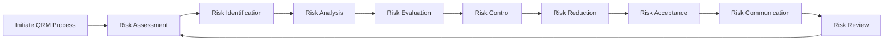

# CSA Regulatory Foundation — Theory & Reference Guide

> This document synthesizes the six regulatory sources identified in [PROJECT_PLAN.md](file:///c:/Users/miste/Desktop/Dev/CSA/PROJECT_PLAN.md) §2.2 as required reading before coding the CSA Validation Automation Framework.

---

## Table of Contents

1. [FDA CSA Guidance (Sept 2025)](#1-fda-csa-guidance-sept-2025)
2. [21 CFR Part 11 — Electronic Records & Signatures](#2-21-cfr-part-11--electronic-records--electronic-signatures)
3. [EU GMP Annex 11 — Computerised Systems](#3-eu-gmp-annex-11--computerised-systems)
4. [GAMP 5 Second Edition (2022)](#4-gamp-5-second-edition-2022)
5. [PIC/S PI 041 — Data Integrity Guidance](#5-pics-pi-041--data-integrity-guidance)
6. [ICH Q9 (R1) — Quality Risk Management](#6-ich-q9-r1--quality-risk-management)
7. [Cross-Reference Matrix](#7-cross-reference-matrix)
8. [Implications for the CSA Framework Codebase](#8-implications-for-the-csa-framework-codebase)

---

## 1. FDA CSA Guidance (Sept 2025)

**Source:** `guidance-computer-software-assurance-production-quality-system.pdf` (local) / [fda.gov/media/188844/download](https://www.fda.gov/media/188844/download)  
**Status:** Final guidance — contains *nonbinding recommendations*  
**Relevance:** **Primary source.** The entire framework implements this.

### 1.1 Purpose & Scope

The guidance provides a **risk-based approach** for assuring that computer software used as part of **production or the quality management system** performs as intended. It replaces the older "General Principles of Software Validation" (2002) with a more modern, *least-burdensome* methodology.

Key scope points:
- Applies to software used in **production** or **quality management systems** of medical device manufacturers
- Includes COTS, SaaS, custom, configurable, and infrastructure software
- Does **not** apply to Software as a Medical Device (SaMD) or software that is a component of a device — those follow separate IEC 62304 pathways
- Applies under ISO 13485 QMSR (aligned with 21 CFR 820 amendments Feb 2026)

### 1.2 The Four-Step CSA Framework

```
┌──────────────────────────────────────────────────────────────────┐
│                   CSA FOUR-STEP FRAMEWORK                        │
│                                                                  │
│  STEP 1 ──► IDENTIFY INTENDED USE                                │
│  STEP 2 ──► DETERMINE RISK-BASED APPROACH                       │
│  STEP 3 ──► SELECT ASSURANCE ACTIVITIES                         │
│  STEP 4 ──► ESTABLISH RECORD                                    │
└──────────────────────────────────────────────────────────────────┘
```

#### Step 1: Identify Intended Use

Determine the **intended use** of each software feature, function, or operation:
- What does each feature/function do?
- Is it used **directly** in production/quality, or is it a **supporting** function?
- Document the intended purpose clearly — this drives everything downstream

> The intended use of a COTS or configured software is determined by the *manufacturer*, not the vendor. The vendor's documentation supports, but does not replace, the manufacturer's determination.

#### Step 2: Determine Risk-Based Approach

Classify each feature/function into one of two risk categories:

| Risk Level | Definition | Key Question |
|---|---|---|
| **HIGH Process Risk** | Failure could result in a quality problem that **foreseeably leads to compromised safety** | If this fails, could a patient be harmed? |
| **NOT HIGH Process Risk** | Failure would **not** foreseeably lead to compromised safety | Failure impacts workflow/compliance but not patient safety |

Critical considerations:
- Risk classification is at the **feature/function** level, not the entire system
- A single system can have features spanning **both** risk levels
- Existing process controls, inspections, and redundancies that prevent patient harm can lower the risk classification
- The determination must be **justified and documented**

#### Step 3: Select Assurance Activities

Assurance activities scale with risk level:

| Risk Level | Primary Testing Approach | Test Plan Requirements | Documentation Level |
|---|---|---|---|
| **HIGH** | **Scripted Testing** — step-by-step procedures with expected results, repeatability testing | Detailed test protocol, independent review/approval | Detailed report, pass/fail per test case, signatory authority |
| **NOT HIGH** | **Unscripted Testing** — exploratory, scenario-based, error-guessing | High-level objectives with pass/fail criteria (no step-by-step needed) | Summary description, issues found, conclusion |

**Types of Unscripted Testing:**
1. **Exploratory Testing** — high-level objectives, tester explores freely
2. **Scenario Testing** — testing features/functions without a formal test plan
3. **Error Guessing** — testing failure modes based on tester experience

**Additional Assurance Activities (applicable to any risk level):**
- Vendor Assessment (SDLC, QMS, certifications, cybersecurity)
- System Capability Assessment
- Installation/Configuration Verification
- Leveraging vendor documentation and testing

> **Key FDA Shift:** The guidance explicitly encourages *unscripted testing* and digital evidence capture — moving away from the legacy model that required scripted IQ/OQ/PQ for everything.

#### Step 4: Establish Record

Every assurance activity must produce a **record** containing:

| Required Record Element | Description |
|---|---|
| **Intended Use** | Clear statement of what the software/feature is used for |
| **Risk-Based Analysis** | Result of risk determination and rationale |
| **Testing Description** | Summary or detailed report of testing performed |
| **Test Results** | Pass/fail for each test case or objective |
| **Issues Found** | Any deviations, failures, or observations |
| **Conclusion** | Declaration of acceptability for intended use, including resolution of issues |
| **Who/When** | Name of tester and date of testing |
| **Review & Approval** | Signature of signatory authority (when appropriate, especially for high-risk) |

Records may be **digital** — the guidance explicitly encourages leveraging electronic/digital records over paper screenshots.

### 1.3 Software Changes

When production/quality system software changes:
1. Re-evaluate intended use (has it changed?)
2. Determine if the change alters the risk assessment
3. Perform assurance activities **commensurate with the change**
4. Document the change assessment

For **SaaS** with automatic updates, the service agreement should require the vendor to provide change documentation, and the manufacturer assesses impact.

### 1.4 Electronic Records & Part 11

The guidance addresses the intersection with 21 CFR Part 11:
- If a document required under Part 820/QMSR is maintained electronically → Part 11 generally applies
- Manufacturers may use the CSA risk-based approach to provide assurance that software maintaining Part 11 records performs as intended
- Activity logs not required for validation evidence are generally exempt from Part 11

### 1.5 Appendix Examples

The guidance provides five detailed examples demonstrating the four-step framework:

1. **Nonconformance Management System** — mixed risk (initiation = not high, product containment = high, e-signature = not high)
2. **Learning Management System (LMS)** — generally not high risk (access control, recordkeeping)
3. **Business Intelligence Application** — mixed risk (connectivity = high, reporting/help = not high)
4. **SaaS PLM System** — generally not high risk, with UAT and automated test scripts for access control
5. **Spreadsheet for monitoring** — not high risk, exploratory testing

---

## 2. 21 CFR Part 11 — Electronic Records & Electronic Signatures

**Source:** [ecfr.gov](https://www.ecfr.gov/current/title-21/chapter-I/subchapter-A/part-11) / [law.cornell.edu](https://www.law.cornell.edu/cfr/text/21/part-11)  
**Relevance:** Electronic records, audit trails, e-signatures — what the demo app must implement.

### 2.1 Structure

| Subpart | Sections | Coverage |
|---|---|---|
| **A — General Provisions** | §11.1–11.3 | Scope, implementation, definitions |
| **B — Electronic Records** | §11.10–11.70 | Controls for closed/open systems, signature manifestations, signature/record linking |
| **C — Electronic Signatures** | §11.100–11.300 | General requirements, components & controls, ID code/password controls |

### 2.2 Key Definitions (§11.3)

| Term | Definition |
|---|---|
| **Electronic Record** | Any combination of text, graphics, data, audio, pictorial, or other information in digital form created, modified, maintained, archived, retrieved, or distributed by a computer system |
| **Electronic Signature** | Computer data compilation of any symbol or series of symbols executed, adopted, or authorized by an individual to be the legally binding equivalent of their handwritten signature |
| **Closed System** | Environment where system access is controlled by persons responsible for the content of electronic records on the system |
| **Open System** | Environment where system access is NOT controlled by persons responsible for the content |
| **Digital Signature** | Electronic signature based on cryptographic methods of originator authentication |
| **Biometrics** | Method of verifying identity based on physical features or repeatable actions unique to that individual |

### 2.3 Controls for Closed Systems (§11.10) — *The Demo App Must Implement These*

| Requirement | §11.10 Ref | Implementation Implication |
|---|---|---|
| **System Validation** | (a) | Ensure accuracy, reliability, consistent intended performance; ability to discern invalid/altered records |
| **Record Copies** | (b) | Generate accurate, complete copies in human-readable and electronic form |
| **Record Protection** | (c) | Enable accurate and ready retrieval throughout retention period |
| **Access Control** | (d) | Limit system access to authorized individuals |
| **Audit Trails** | (e) | Secure, computer-generated, time-stamped audit trails recording date/time of operator entries that create, modify, or delete records. Changes must **not obscure** previous information. Retained as long as subject records. |
| **Operational Checks** | (f) | Enforce permitted sequencing of steps and events |
| **Authority Checks** | (g) | Only authorized individuals can sign, access, alter records, or perform operations |
| **Device Checks** | (h) | Validate source of data input or operational instruction |
| **Personnel Qualification** | (i) | Persons developing/maintaining/using systems must have adequate education, training, and experience |
| **Accountability Policies** | (j) | Written policies holding individuals accountable for actions under their e-signatures |
| **Documentation Controls** | (k) | Controls over distribution, access, use of system documentation; revision/change control with audit trail |

### 2.4 Signature Manifestations (§11.50)

Every signed electronic record must display:
1. **Printed name** of the signer
2. **Date and time** of signature execution
3. **Meaning** of the signature (e.g., review, approval, responsibility, authorship)

### 2.5 Signature/Record Linking (§11.70)

Electronic signatures must be **linked** to their respective records such that signatures cannot be excised, copied, or transferred to falsify a record.

### 2.6 Electronic Signature Requirements (§11.100–§11.300)

| Requirement | Detail |
|---|---|
| **Uniqueness** | Each e-signature must be unique to one individual; never reused/reassigned |
| **Identity Verification** | Organization must verify identity before assigning an e-signature |
| **Certification** | Must certify to FDA that e-signatures are intended as legally binding equivalents |
| **Two-Factor** | Non-biometric e-signatures must employ ≥2 distinct identification components (e.g., user ID + password) |
| **Continuous Use** | During single continuous session: first signing = all components; subsequent = at least one component |
| **Non-Continuous** | Each signing outside continuous access = all components required |
| **Anti-Spoofing** | Use of another's e-signature must require collaboration of ≥2 individuals |
| **Password Controls** | Unique combinations, periodic revision/aging, loss management, unauthorized use detection |

---

## 3. EU GMP Annex 11 — Computerised Systems

**Source:** [EudraLex Vol. 4 Annex 11](https://health.ec.europa.eu/document/download/0d9c42ca-035f-4eaa-a085-efeb5c80db5f_en) (Revision 1, effective June 2011)  
**Relevance:** European counterpart to FDA CSA. Broadens project applicability.

### 3.1 Principle

> *"This annex applies to all forms of computerised systems used as part of GMP regulated activities."*

Key principles:
- Application = validated; IT infrastructure = qualified
- Replacing manual operations must not decrease product quality, process control, or quality assurance
- Must not increase the overall risk of the process

### 3.2 Clause Summary

| Clause | Topic | Key Requirements |
|---|---|---|
| **1** | Risk Management | Applied throughout lifecycle; validation/data integrity decisions based on documented risk assessment |
| **2** | Personnel | Close cooperation between Process Owner, System Owner, QP, and IT; defined responsibilities |
| **3** | Suppliers & Service Providers | Formal agreements; supplier competence/reliability assessment; COTS documentation review |
| **4** | Validation | Lifecycle-based; URS traceable throughout lifecycle; appropriate test methods demonstrated |
| **5** | Data | Built-in checks for correct/secure data entry and processing |
| **6** | Accuracy Checks | Additional check for critical manual data entry (second operator or validated electronic means) |
| **7** | Data Storage | Physical & electronic security; accessibility throughout retention period; regular backups tested |
| **8** | Printouts | Clear printed copies of electronic data; batch release printouts indicate if data changed |
| **9** | Audit Trails | Risk-based; record all GMP-relevant changes/deletions with reason; available in intelligible form; regularly reviewed |
| **10** | Change & Configuration Management | Controlled manner per defined procedure |
| **11** | Periodic Evaluation | Confirm systems remain valid/compliant; review functionality, incidents, performance, security |
| **12** | Security | Physical/logical access controls; creation/change/cancellation of authorizations recorded |
| **13** | Incident Management | All incidents reported/assessed; root cause identified for critical incidents → CAPA |
| **14** | Electronic Signature | Same impact as handwritten within company; permanently linked to record; include time and date |
| **15** | Batch Release | Only QPs can certify release; using electronic signatures |
| **16** | Business Continuity | Provisions for system breakdown; manual/alternative systems; risk-based recovery time |
| **17** | Archiving | Data checked for accessibility, readability, integrity; ability to retrieve after system changes |

### 3.3 Key Differences from FDA CSA

| Aspect | FDA CSA | EU GMP Annex 11 |
|---|---|---|
| **Focus** | Risk-based assurance of production/QMS software | GMP compliance for all computerised systems |
| **Risk Framework** | Four-step CSA framework | ICH Q9-aligned risk management throughout lifecycle |
| **Testing Approach** | Explicitly promotes unscripted testing for not-high-risk | Traditional validation with risk-based justification |
| **Audit Trails** | Part 11 cross-reference | Risk-based, regularly reviewed, all GMP-relevant changes |
| **Periodic Review** | On change | Periodic evaluation to confirm continued valid state |

---

## 4. GAMP 5 Second Edition (2022)

**Source:** [ISPE](https://ispe.org/publications/guidance-documents/gamp-5-guide-2nd-edition) (paid publication; 50% discount for AR members)  
**Relevance:** Software categories, V-model, risk-based lifecycle.

### 4.1 Overview

GAMP 5 2nd Edition (July 2022) modernizes guidance for GxP computerized systems by shifting from traditional **Computerized System Validation (CSV)** to **Computer Software Assurance (CSA)**, aligning with FDA's risk-based approach. Core goals: **patient safety, product quality, data integrity.**

### 4.2 Software Categories

| Category | Name | Description | Validation Effort | Examples |
|---|---|---|---|---|
| **1** | Infrastructure Software | OS, databases, networks — foundational systems with no user-specific logic | Minimal (foundational quality) | OS, firewalls, antivirus, database engines |
| **3** | Non-Configurable Software | COTS used "as is" without configuration or customization | Low-moderate — relies on vendor quality | Commercial data analysis tools, simple chromatography |
| **4** | Configurable Software | Systems tailored through configuration (no source code changes) | Moderate — configuration verification + testing | ERP, LIMS, eQMS platforms |
| **5** | Custom Software | Bespoke code developed for specific use cases | Highest — full SDLC, code review, extensive testing | Custom production control apps, VBA spreadsheets |

> **Note:** Category 2 has been **removed** in GAMP 5 2nd Edition. Categories are now viewed as a **continuum**, and categorization is just one factor in determining lifecycle activities.

### 4.3 Risk-Based Lifecycle

Key principles:
- **Scale activities** based on GxP impact, complexity, and novelty
- **Leverage supplier** expertise and documentation
- Supports **iterative and agile** development (not just V-model)
- Supports modern IT: **cloud-based QMS**, continuous integration testing, automated data capture
- Align with **ICH Q9** Quality Risk Management
- Move away from rigid, document-heavy validation models

### 4.4 V-Model (Evolved)

```
Requirements  ◄─────────────────►  Acceptance Testing
    │                                       │
    ▼                                       ▲
Design Specs  ◄─────────────────►  Integration Testing  
    │                                       │
    ▼                                       ▲
Detailed Design ◄───────────────►  Unit Testing
    │                                       │
    └──────────►  Code  ◄──────────────────┘
```

GAMP 5 2nd Edition acknowledges the V-model but **explicitly supports agile/iterative** approaches where validation activities are integrated throughout development rather than concentrated at the end.

---

## 5. PIC/S PI 041 — Data Integrity Guidance

**Source:** [picscheme.org](https://picscheme.org/docview/4234) (PI 041-1, July 2021)  
**Relevance:** ALCOA+ principles that the evidence capture module enforces.

### 5.1 ALCOA+ Principles

The cornerstone of data integrity — every data record must be:

| Attribute | Requirement |
|---|---|
| **A — Attributable** | Identify who (individual or system) performed a task and when, including all changes (who, when, why) |
| **L — Legible** | Readable, unambiguous, understandable, and of use throughout the data lifecycle |
| **C — Contemporaneous** | Recorded as events take place — an accurate attestation of what was done/decided and why |
| **O — Original** | First-capture of information; dynamic data must remain available in dynamic state |
| **A — Accurate** | Truthful representation of facts; assured through equipment qualification, calibration, validation, procedures, deviation management, training |
| **C — Complete** | All critical information present, nothing lost or deleted; includes relevant metadata for electronic records |
| **C — Consistent** | Created, processed, and stored in a logical manner with standardized formats (dates, units, rounding, etc.) |
| **E — Enduring** | Exist for the entire required retention period; remain intact, accessible, indelible, and durable |
| **A — Available** | Accessible in readable format at any time during retention period for release decisions, investigations, audits, inspections |

### 5.2 Data Governance System

PI 041 requires organizations to establish a **data governance system** that:
- Provides assurance of data integrity across the entire data lifecycle
- Integrates with the Pharmaceutical Quality System (PQS)
- Addresses data ownership throughout the lifecycle
- Controls both intentional and unintentional changes/deletions
- Uses a combination of **organizational** and **technical** controls

#### Organizational Controls
- Procedures for record completion and retention
- Training and documented authorization for data generation/approval
- Routine data verification (daily, batch-related)
- Periodic surveillance through self-inspection
- Personnel with data management/security expertise

#### Technical Controls
- Computerized system validation, qualification, and control
- Automation
- Technologies providing greater data management/integrity controls

### 5.3 Data Criticality & Risk

Two dimensions assessed together:

1. **Data Criticality** = impact on decision-making and product quality
   - Which decision does the data influence?
   - What is the impact to product quality or safety?

2. **Data Risk** = opportunity for data alteration/deletion and likelihood of detection
   - Vulnerability to involuntary alteration, loss, or deliberate falsification
   - Effectiveness of existing controls and review processes
   - Process complexity, automation level, subjectivity of outcomes

> **Key Insight:** Computerized system validation *alone* may not result in low data integrity risk — especially if users can influence data reporting. Fully automated, validated processes with minimal human intervention are preferable.

### 5.4 Key Computerized System Considerations (Section 9)

| Topic | Key Points |
|---|---|
| **System Inventory** | Maintain an inventory of all computerized systems with assessment of criticality and risk |
| **Validation** | Risk-based; User Requirements Specs should address data integrity; validated state maintained throughout lifecycle |
| **Audit Trails** | Must be enabled, reviewed, and cannot be modified/disabled by users; should capture who/what/when/why |
| **Access Control** | Unique user accounts, role-based access, segregation of duties, no shared accounts |
| **System Security** | Administrative access restricted; configuration changes controlled; network security |
| **Data Review** | Electronic data review preferred over paper printouts; use of exception reports where validated |
| **Backup & Recovery** | Regular, verified, and documented; disaster recovery plans tested |
| **True Copies** | Verified process for creating copies that maintain data integrity, including metadata |

### 5.5 Quality Culture

PI 041 uniquely emphasizes **organizational culture** as a critical factor:
- Management must create transparent, open environments where failures can be freely reported
- Appropriate resources for data management
- No undue pressure on personnel that could incentivize data integrity lapses
- Confidential escalation programs for reporting breaches
- Regular management review of data integrity performance indicators

---

## 6. ICH Q9 (R1) — Quality Risk Management

**Source:** [ich.org](https://www.ich.org/page/quality-guidelines#9) (adopted January 2023, effective July 2023)  
**Relevance:** FMEA methodology used by the risk engine.

### 6.1 Overview

ICH Q9 R1 provides principles and tools for **quality risk management (QRM)** across the entire pharmaceutical product lifecycle. The R1 revision (2023) addresses four key areas:

1. **Minimizing subjectivity** in risk assessments
2. **Supply and product availability** risk management
3. **Clarifying "formality"** — formality is a *spectrum*, not binary
4. **Risk-based decision-making** clarity

### 6.2 QRM Process



### 6.3 Risk Assessment Tools

| Tool | Abbreviation | Best Used For |
|---|---|---|
| **Failure Mode Effects Analysis** | FMEA | Analyzing potential failure modes, their effects, and causes — *primary tool for the risk engine* |
| **Failure Mode Effects & Criticality Analysis** | FMECA | FMEA + criticality ranking |
| **Fault Tree Analysis** | FTA | Top-down analysis of system failure causes |
| **Hazard Analysis & Critical Control Points** | HACCP | Process-specific hazard identification and control |
| **Hazard Operability Analysis** | HAZOP | Systematic examination of process deviations |
| **Preliminary Hazard Analysis** | PHA | Early-stage hazard identification |
| **Risk Ranking & Filtering** | — | Comparing and ranking risks |
| **Basic facilitation methods** | — | Flowcharts, check sheets, cause-and-effect diagrams |

### 6.4 FMEA Methodology (Primary Tool for Risk Engine)

FMEA evaluates three dimensions for each potential failure mode:

| Dimension | Question | Scale |
|---|---|---|
| **Severity (S)** | How serious is the effect of failure? | 1–10 (1 = negligible, 10 = catastrophic) |
| **Occurrence (O)** | How likely is this failure to happen? | 1–10 (1 = improbable, 10 = almost certain) |
| **Detection (D)** | How likely is detection before impact? | 1–10 (1 = certain detection, 10 = undetectable) |

**Risk Priority Number (RPN)** = Severity × Occurrence × Detection

```
RPN Range    Risk Level          Action Required
─────────    ──────────          ───────────────
1–40         LOW                 Accept / monitor
41–100       MEDIUM              Control measures recommended
101–200      HIGH                Risk reduction required
201–1000     CRITICAL            Immediate action; cannot proceed without controls
```

> **R1 Clarification:** The level of effort and formality should be **commensurate with the level of risk**. Simple, low-risk assessments may use basic facilitation methods; complex, high-risk assessments warrant formal FMEA with full documentation.

### 6.5 Core Principles

1. Risk assessment should be **science-based** and **linked to patient protection**
2. The level of effort, formality, and documentation should be **proportionate to risk**
3. QRM must be applied **throughout the entire product lifecycle**
4. Risk management decisions should be **transparent, reproducible, and documented**
5. Regular **risk review** is essential — risk profiles change over time

---

## 7. Cross-Reference Matrix

How each regulatory source maps to the project's modules:

| Module | FDA CSA | 21 CFR Part 11 | Annex 11 | GAMP 5 | PIC/S PI 041 | ICH Q9 |
|---|---|---|---|---|---|---|
| `system_inventory/` | Step 1: Intended Use | — | Cl. 4.3: System listing | Cat. 1/3/4/5 classification | §9.1: System inventory | — |
| `risk_engine/` | Step 2: Risk classification | — | Cl. 1: Risk management | Risk-based lifecycle | §5.3–5.5: Data criticality/risk | **FMEA methodology** |
| `test_suites/` | Step 3: Scripted testing | — | Cl. 4.7: Test methods | Validation testing per category | — | RPN-driven test selection |
| `exploratory_logger/` | Step 3: Unscripted testing | — | — | — | — | — |
| `evidence_capture/` | Step 4: Record | §11.10(b,c): Record copies/protection | Cl. 7, 8, 9: Data storage, printouts, audit trails | — | **ALCOA+ enforcement** | — |
| `report_generator/` | Step 4: Conclusion + who/when | §11.50: Signature manifestations | Cl. 14: Electronic signature | — | §7.7: True copies | — |
| Demo App | — | **§11.10: All controls** | Cl. 12: Security, Cl. 14: E-sig | Cat. 4/5 validation | §9.5–9.6: Security, audit trails | — |

---

## 8. Implications for the CSA Framework Codebase

### 8.1 Demo App Must Implement (21 CFR Part 11 Compliance)

- [ ] **Audit Trail System** — time-stamped, computer-generated, recording who/what/when for all creates/modifies/deletes; changes must not obscure previous data (§11.10(e))
- [ ] **Role-Based Access Control** — unique user accounts, authority checks, limit access to authorized individuals (§11.10(d,g))
- [ ] **Electronic Signatures** — name + date/time + meaning (review/approval/authorship); linked to records; two-factor (user ID + password) (§11.50, §11.70, §11.200)
- [ ] **Record Protection** — accurate retrieval throughout retention period (§11.10(c))
- [ ] **System Validation Evidence** — the framework itself demonstrates that the demo app is validated (§11.10(a))

### 8.2 Evidence Capture Module Must Enforce (ALCOA+)

- [ ] **Attributable** — every action tagged with user identity and timestamp
- [ ] **Legible** — structured, human-readable output formats (not raw logs)
- [ ] **Contemporaneous** — real-time capture during test execution, not retrospective
- [ ] **Original** — preserve first-capture data in original format; maintain dynamic records dynamically
- [ ] **Accurate** — automated capture reduces transcription errors; validated against expected results
- [ ] **Complete** — include all metadata, no partial records
- [ ] **Consistent** — standardized formats (dates, identifiers, measurements)
- [ ] **Enduring** — stored securely for the required retention period
- [ ] **Available** — accessible for review, audit, and inspection at any time

### 8.3 Risk Engine Must Implement (ICH Q9 / FMEA)

- [ ] **FMEA Calculator** — Severity × Occurrence × Detection = RPN
- [ ] **Risk Classification** — map RPN to risk levels per FDA's HIGH/NOT HIGH framework
- [ ] **Risk Matrix Visualization** — clear display of risk distribution
- [ ] **Proportionate Testing Selection** — HIGH risk → scripted testing; NOT HIGH → unscripted
- [ ] **Documentation of Risk Rationale** — structured output matching FDA Step 2 requirements

### 8.4 Report Generator Must Produce (FDA Step 4)

Every validation report must contain all seven required record elements:
1. Intended use statement
2. Risk-based analysis result and rationale
3. Testing description (summary or detailed)
4. Test results (pass/fail per objective or test case)
5. Issues found and their disposition
6. Conclusion of acceptability for intended use
7. Tester identity and date

For HIGH-risk items: additional test protocol, detailed test report, signatory authority with date.

### 8.5 Software Category Handling (GAMP 5)

The `system_inventory` module should classify software using GAMP 5 categories to inform testing depth:

| Category | → Test Approach |
|---|---|
| Cat. 1 (Infrastructure) | Minimal — infrastructure qualification |
| Cat. 3 (Non-configurable COTS) | Vendor assessment + basic functional verification |
| Cat. 4 (Configurable) | Configuration verification + unscripted testing |
| Cat. 5 (Custom) | Full lifecycle testing per risk level |

---

> **Document compiled from:** FDA CSA Guidance (Sept 2025/Feb 2026), 21 CFR Part 11, EU GMP Annex 11 (Rev. 1, 2011), GAMP 5 2nd Edition (2022), PIC/S PI 041-1 (July 2021), ICH Q9 R1 (Jan 2023).
