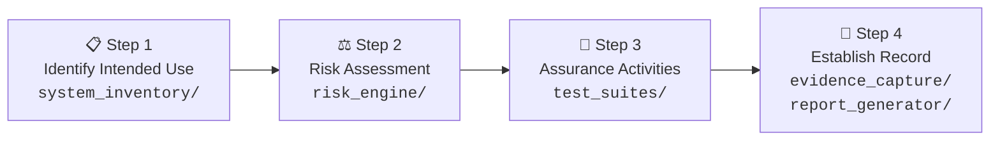

# CSA Validation Automation Framework

### Bridging Pharmaceutical Quality & Software Test Automation

[](https://github.com/miltonklun/pharma-csa-framework/actions)
[](https://python.org)
[](LICENSE)
[](https://www.fda.gov/media/188844/download)

---

## 🎯 What Is This?

An open-source **Python/Playwright framework** that implements the FDA's **Computer Software Assurance (CSA)** methodology as an automated validation lifecycle.

It takes a pharmaceutical software system, **classifies its features by risk**, generates and executes the **appropriate level of testing** (scripted or unscripted), captures **digital evidence**, and produces a complete **CSA Validation Summary Report** — all aligned to the FDA's final CSA guidance (September 2025).

---

## 🔬 Why Does This Matter?

The pharmaceutical industry is in the middle of a historic shift. The FDA's final CSA guidance (September 2025) formally moves the industry away from **documentation-heavy Computer System Validation (CSV)** toward a **risk-based, critical-thinking approach**.

The core idea:

> **Spend 80% of your effort testing, not documenting** — the _inverse_ of traditional CSV.

The problem? Most pharma companies don't have the technical expertise to automate this new approach, and most QA automation engineers don't understand the pharma regulatory context.

**This framework bridges that gap.**

---

## 🏗️ Architecture — The CSA Four-Step Framework in Code

Every module in this repository maps directly to the FDA's CSA process:



| CSA Step | Module | What It Does |
|----------|--------|-------------|
| **Step 1** — Identify Intended Use | `system_inventory/` | Catalogs software features, classifies direct vs. supporting use |
| **Step 2** — Risk Assessment | `risk_engine/` | FMEA-based risk calculation → HIGH / NOT HIGH classification |
| **Step 3a** — Scripted Testing | `test_suites/scripted/` | Automated Playwright tests for HIGH-risk features |
| **Step 3b** — Unscripted Testing | `test_suites/unscripted/` | Exploratory test session logger for NOT HIGH-risk features |
| **Step 4a** — Evidence Capture | `evidence_capture/` | Digital evidence collection + ALCOA+ validation |
| **Step 4b** — Report Generation | `report_generator/` | Auto-generated Validation Summary Report (HTML/PDF) |

---

## 🎮 Demo App — The System Under Validation

The framework validates a simplified **pharmaceutical Quality Management System (QMS)** built with FastAPI + PostgreSQL. It simulates the kind of regulated software pharma companies actually need to validate:

| Feature | Risk Level | Regulatory Driver |
|---------|-----------|-------------------|
| 🔐 User Authentication + Roles | **HIGH** | 21 CFR Part 11 §11.10(d) |
| ✍️ Electronic Signatures | **HIGH** | 21 CFR Part 11 §11.50, §11.70 |
| 📝 Audit Trail | **HIGH** | 21 CFR Part 11 §11.10(e) |
| ⚠️ Deviation Management | **HIGH** | GMP workflow integrity |
| 🔧 CAPA Management | NOT HIGH | Supporting quality function |
| 📄 Document Control | NOT HIGH | Supporting quality function |
| 📊 Dashboard / Reporting | NOT HIGH | Informational function |

---

## 🛡️ Recent Compliance Upgrades

- **Evidence Integrity**: SHA-256 cryptographic hashing and OS metadata for all exported artifacts, ensuring strict chain of custody and preventing tampering (PIC/S PI 041).
- **Strict ALCOA+**: Expanded programmatic validation to all 9 data integrity principles, with chronologically consistent timestamp checks and fail-fast CI/CD pipeline enforcement.
- **21 CFR Part 11**: Strict 15-minute JWT session timeouts, industry-standard password complexity rules, and foolproof business action attribution in the SQL ORM audit trail.
- **ICH Q9 Risk Assessment**: Visible Risk Matrix terminal outputs and interactive Defect Severity classification during unscripted exploratory testing.
- **Validation Summary Report**: Integrated scripted Pytest outputs alongside unscripted exploratory sessions into the final auto-generated PDF.

---

## 🚀 Quick Start

### Prerequisites

- Python 3.11+
- Docker & Docker Compose
- Git

### Setup

```bash
# Clone the repository
git clone https://github.com/miltonklun/pharma-csa-framework.git
cd pharma-csa-framework

# Create and activate virtual environment
python -m venv venv
source venv/bin/activate  # On Windows: venv\Scripts\activate

# Install dependencies
pip install -e ".[dev]"

# Install Playwright browsers
playwright install chromium

# Start the demo app
cd demo_app && docker-compose up -d && cd ..

# Run the full CSA validation pipeline
make validate
```

### View Reports

```bash
# Open the generated Validation Summary Report
open report_generator/outputs/Validation_Summary_Report.pdf

# View Allure test report
allure serve allure-results/
```

---

## 📚 Pharma-to-Code Glossary

| Pharma Quality Concept | Software QA Equivalent | Framework Module |
|----------------------|----------------------|--------------------|
| CSA Intended Use Assessment | Requirements analysis | `system_inventory/` |
| Risk Assessment (FMEA / ICH Q9) | Test prioritization matrix | `risk_engine/` |
| GAMP Software Categories | System classification | `risk_engine/config/` |
| Scripted Testing (IQ/OQ/PQ) | Automated Playwright tests | `test_suites/scripted/` |
| Unscripted Testing (Exploratory) | Exploratory test sessions | `test_suites/unscripted/` |
| ALCOA+ Data Integrity | Data quality assertions | `evidence_capture/validators/` |
| Validation Summary Report | Test execution report | `report_generator/` |
| Audit Trail | DB change tracking | `evidence_capture/` |
| Electronic Signature | Authenticated user action | Demo app feature |
| Continuous Validation | CI/CD pipeline | `.github/workflows/` |

> 📖 Full glossary: [`docs/glossary.md`](docs/glossary.md)

---

## 📖 Regulatory References

This framework implements concepts from:

1. **FDA CSA Guidance** (Sept 2025) — [fda.gov/media/188844/download](https://www.fda.gov/media/188844/download)
2. **21 CFR Part 11** — Electronic Records & Electronic Signatures
3. **EU GMP Annex 11** — Computerised Systems
4. **GAMP 5 Second Edition** (2022) — Software Categories & Risk-Based Lifecycle
5. **PIC/S PI 041** — Data Integrity Guidance (ALCOA+ Principles)
6. **ICH Q9 (R1)** — Quality Risk Management (FMEA Methodology)

> 📖 Detailed regulatory analysis: [`CSA_INFO.md`](CSA_INFO.md)

---

## 🗂️ Project Structure

```
pharma-csa-framework/
├── README.md                           # This file
├── CSA_INFO.md                         # Regulatory theory & reference guide
├── docs/                               # Documentation
│   ├── glossary.md                     # Pharma ↔ Software QA mapping
│   ├── csa_methodology.md              # How the framework implements CSA
│   └── templates/                      # Validation document templates
├── demo_app/                           # Target system under validation
│   ├── app/                            # FastAPI application
│   ├── Dockerfile
│   └── docker-compose.yml
├── system_inventory/                   # CSA Step 1: Intended Use
├── risk_engine/                        # CSA Step 2: Risk Assessment
├── test_suites/
│   ├── scripted/                       # CSA Step 3a: Automated tests
│   └── unscripted/                     # CSA Step 3b: Exploratory logger
├── evidence_capture/                   # CSA Step 4a: Digital evidence
├── report_generator/                   # CSA Step 4b: Report generation
├── .github/workflows/                  # CI/CD validation pipeline
└── tests/                              # Unit tests for framework modules
```

---

## 🛠️ Technology Stack

| Component | Technology |
|-----------|-----------|
| Demo App | Python + FastAPI + PostgreSQL |
| Test Automation | Playwright + pytest |
| Risk Engine | Python + YAML configs |
| Evidence Capture | Python + psycopg2 |
| Report Generation | Jinja2 + HTML/PDF (WeasyPrint) |
| CI/CD | GitHub Actions |
| Containerization | Docker + Docker Compose |

---

## ⚠️ Disclaimer

This framework is a **learning and demonstration project**. It is not intended to serve as regulatory advice or to replace professional CSV/CSA validation services. The regulatory interpretations within this project reflect the author's understanding of publicly available FDA guidance documents and industry best practices. Always consult with qualified regulatory professionals for actual validation activities.

---

## 📝 License

This project is licensed under the [MIT License](LICENSE).

---

## Author

**Milton Klun**  
*QA Automation Engineer | Backend Developer*

<div align="left">
  <a href="https://www.linkedin.com/in/milton-klun/"></a><a href="mailto:miltonericklun@gmail.com"></a><a href="https://www.miltonklun.com"></a>
</div>
